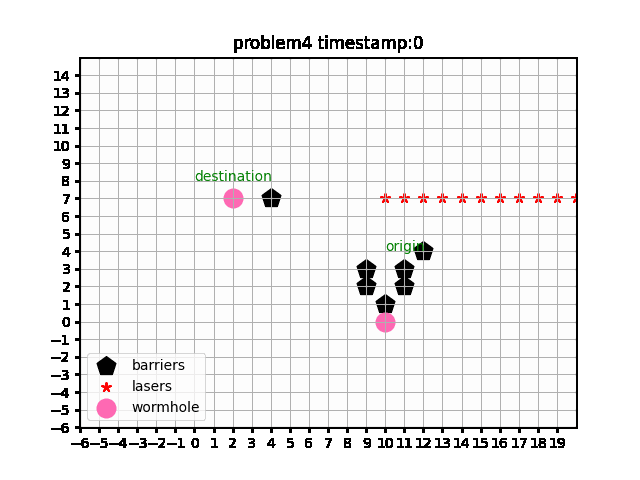

# route_planning_in_unlimited_grid_world

this this a demo for A* based planning in a unlimited robot world.


## HOW TO RUN:

#### 1. Download Ubuntu container image.
   `docker pull ubuntu:16.04`
   
   `docker run -it --entrypoint=/bin/bash -v $(pwd)/route_planning_in_unlimited_grid_world:/route_planning_in_unlimited_grid_world ubuntu:16.04`
#### 2. Set up docker env

`cd route_planning_in_unlimited_grid_world/`

`./setup.sh`
   
#### 3. Run in docker

`makedir build`

`cd build`

`cmake ../src/`

`make`

`./route_plan -f problem1`

```
./rideos_oa -h
Usage: shell [-fsdw]
    -f  problem folder name, such as, sample, problem2, etc.
    -s  enable static laser.
    -d  enable dynamic laser.
    -d  enable wormholes.
 ```


## RESULTS:



